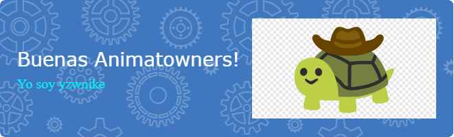

# ¡Hola! Soy YZWNIKE 👋

¡Bienvenido a mi perfil de GitHub! Soy un entusiasta de la programación y me encanta contribuir a proyectos de código abierto. Aquí encontrarás algunos detalles interesantes sobre mí y mi actividad en GitHub.

## Sobre Mí

- 🌱 Actualmente estoy aprendiendo nuevas tecnologías y mejorando mis habilidades de programación.
- 💼 Estoy buscuando experiencia en estudios de informática.
- 💬 Si tienes alguna pregunta o sugerencia, no dudes en contactarme.

## Estadísticas de GitHub

## Lenguajes Más Utilizados

- 
- 
- 
- 
- 

## Barras de Contribuciones

## Estado en GitHub

## Otras Estadísticas

- [GitHut](https://githut.info/yzwnike)
- [Git Awards](https://git-awards.com/)

  

¡Gracias por visitar mi perfil! Espero que encuentres útil la información aquí proporcionada. ¡No dudes en seguirme y explorar mis proyectos!

